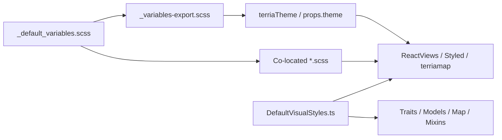
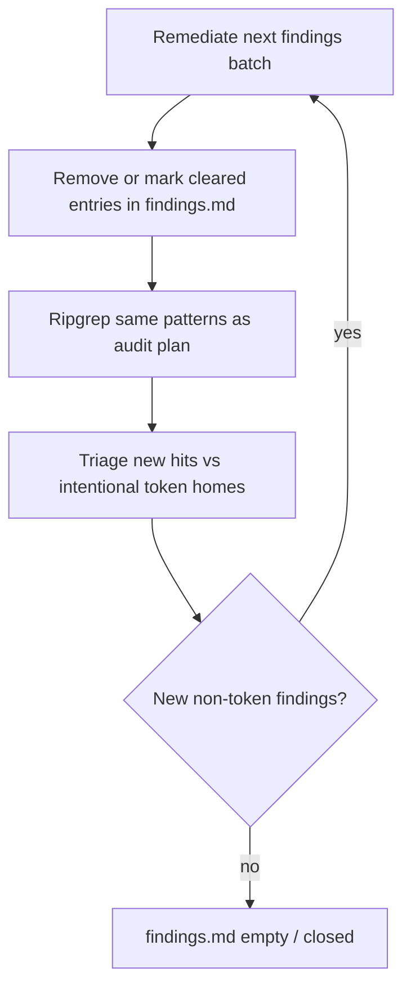

# Clear all findings.md magic numbers

## Scope

Remediate **everything** listed in [`packages/terriajs/doc/ui-ux-audit/findings.md`](packages/terriajs/doc/ui-ux-audit/findings.md) (~198+ entries across Traits, ModelMixins, Table, Models, Map, ReactViews, Styled, terriamap). Documentation under `doc/ui-ux-audit/` is updated as items are cleared; work stops when a full re-scan adds zero new findings and `findings.md` has no open items.

## Architecture (committed)

Two token homes — do not invent a third:

1. **UI chrome tokens** — Sass is source of truth: [`lib/Sass/common/_default_variables.scss`](packages/terriajs/lib/Sass/common/_default_variables.scss) → [`lib/Sass/exports/_variables-export.scss`](packages/terriajs/lib/Sass/exports/_variables-export.scss) → [`StandardTheme.tsx`](packages/terriajs/lib/ReactViews/StandardUserInterface/StandardTheme.tsx) `terriaTheme`. Co-located SCSS `@use`s `terriajs-variables`. Styled-components use `props.theme` / `useTheme()`.
2. **Data-visual / map / drawing defaults** — TypeScript is source of truth: new [`lib/Core/DefaultVisualStyles.ts`](packages/terriajs/lib/Core/DefaultVisualStyles.ts) (named constants; expand [`StandardCssColors.ts`](packages/terriajs/lib/Core/StandardCssColors.ts) only for categorical palettes like QueryChart’s 137-color series). Traits, Models, Map, Mixins, and any UI that needs the same default **import these constants** — never re-hardcode hex/`px` in those layers.

**Component style placement rule:** every ReactViews/Styled surface with findings must own styles in either (a) existing co-located `*.scss`, (b) a new co-located `*.scss` when the component already uses CSS modules / layout shell, or (c) a co-located `*.styles.ts` (styled-components factory using `theme`) when the area is already styled-only (Tools: ClippingBox, KeyboardMode, PedestrianMode). No new inline hex/`Npx`/raw rgba/z-index in TSX/JSX.

## Phase 0 — Expand token homes first

Before touching consumers, add missing shared tokens so remediations only reference names:

**In `_default_variables.scss` (+ mirror overrides in `_rer3d_variables.scss` if present):**

- **Z-index scale** (replace ad-hoc `0/1/2/3/9/10/99/100/999/1000/99989/99999`): e.g. `$z-base`, `$z-map-chrome`, `$z-side-panel`, `$z-dropdown`, `$z-panel-float`, `$z-splitter`, `$z-modal-backdrop`, `$z-modal`, `$z-toast`, `$z-overlay-top` — map existing `$front-component-z-index` / `$notification-window-z-index` / `$editor-popup-z-index` into this scale.
- **Export chart tokens to JS** (already in Sass but not in `:export`): `$chart-grid-color`, `$chart-axis-color`, `$chart-text-color`, `$chart-line-color`, panel colors. Add any React-only chart chrome still using `#efefef` / `#a0a0a0` as explicit tokens (do not silently change visual intent — name tokens to current values, then optionally converge later).
- **Export gaps:** `$warning`, `$modal-overlay`, `$editor-popup-z-index`, focus outline width if needed.
- **Shadow/overlay:** ensure recurring `rgba(0,0,0,0.05/0.12/0.16/0.2/0.3/0.75)` map onto `$shadow-*`, `$overlay`, `$modal-overlay`, `$dark-alpha` — add only if no existing token matches.

**In `_variables-export.scss` + `.d.ts`:** export every new UI token the React theme needs (camelCase).

**In `DefaultVisualStyles.ts`:** constants covering findings in Traits/Models/Map/Table/Mixins, including at least:

- region fill `#02528d`, label fill/outline, trail white, basemap contrast white/black, POI label/icon colors, `DEFAULT_HIGHLIGHT` (`#ff3f00`, GlobeOrMap `#fffffe`), UserDrawing gold / stroke, Table `DEFAULT_COLOR`, transparent nulls, Mapbox HSL line, 3D tiles fallback, ESRI null `#FFFFFF`, workflow `#aaa`/`#fff`/`#000`, MyLocation/preview `#08ABD5`, font strings like `30px sans-serif` / `12px sans-serif` where they are visual defaults (not layout chrome).

**In `StandardCssColors.ts`:** move QueryChart’s inline 137-color palette into a named export (e.g. `queryChartSeries`).

## Phase 1 — Traits / ModelMixins / Table / Models / Map

For each finding in those sections of `findings.md`:

- Replace string literals with imports from `DefaultVisualStyles` (or `StandardCssColors` for palettes).
- Keep trait _API_ the same (still string defaults); only the value source changes.
- Inline HTML snippets (Gtfs, Senaps, Nominatim, TableStylingWorkflow preview) get sizes/colors from the same constants or trivial shared helpers — no raw magic left in the template string.
- Leaflet `zIndex = 100` → named constant from visual/map defaults (or a small `MapLayerZIndex` in the TS defaults module), not a UI theme import if Models must stay Sass-free.

## Phase 2 — Styled primitives

Clear [`lib/Styled/`](packages/terriajs/lib/Styled/) findings (Checkbox, Input, Button, List, Box, Text, Select, Spacing, mixins):

- Colors → `theme.*` / existing semantic tokens (`textLight`, `textWarning`, `grey*`, `ring`, etc.); add tokens only when no match.
- Spacing/type scale in `Text.tsx` → theme padding/font-size exports or new `$font-size-*` already in Sass exported to theme.
- Box/List shadows and scrollbar mixins → `$shadow-*` / existing scrollbar tokens.

## Phase 3 — ReactViews UI (batch by findings.md subsections)

Work through Tools → Panels → Map Navigation → Workbench → Charts → Story/Notification/Tour/etc.:

| Situation                                                                                              | Action                                                                                                               |
| ------------------------------------------------------------------------------------------------------ | -------------------------------------------------------------------------------------------------------------------- |
| Co-located `*.scss` already exists (HelpPanel, ColorPanel, Chart, Notification, Story, CoordsPanel, …) | Move magic into that SCSS using Sass variables; leave TSX className-driven                                           |
| Styled-only Tools without SCSS                                                                         | Create `Component.styles.ts` (or shared `MovementControls.styles.ts`) using `theme`; delete local hex/`px` constants |
| Inline `style={{…}}` / styled template with raw rgba                                                   | Replace with `theme.shadowMd`, `theme.overlay`, `theme.modalOverlay`, etc.                                           |
| z-index literals                                                                                       | Replace with exported scale (`theme.zToast`, …)                                                                      |
| Chart `#efefef` cluster                                                                                | Use exported chart theme tokens                                                                                      |
| `QueryChart.tsx` palette                                                                               | Import `StandardCssColors.queryChartSeries`                                                                          |

Also clear [`apps/terriamap/lib/Views/Loader.tsx`](apps/terriamap/lib/Views/Loader.tsx) via theme or a tiny app token tied to `$dark`.

## Phase 4 — Ensure every touched UI surface has a style module

After Phase 3, for any ReactViews file that still embeds non-trivial styled-blocks with tokens but no dedicated style file, extract to co-located `*.styles.ts` or `*.scss` so “component ↔ style file” pairing holds. Prefer matching local convention (SCSS modules vs styled) over forcing one pattern everywhere.

## Phase 5 — Iterate audit until empty

Patterns (same as audit): `#hex`, `rgba?(`, `hsla?(`, `\d+px`, `zIndex`/`z-index`, inline `style={{` with literals. Skip token homes: `_default_variables.scss`, `_variables-export.scss`, `StandardCssColors.ts`, `DefaultVisualStyles.ts`, and generated `*.scss.d.ts`.

Update [`checked-files.md`](packages/terriajs/doc/ui-ux-audit/checked-files.md) only if new files are introduced; keep `findings.md` as the live backlog (cleared items removed or moved to a short “Cleared” appendix with date — prefer removal so the file converges to empty open work).

## Done criteria

- No open entries in `findings.md`.
- Full-scope ripgrep finds no magic numbers outside token homes and intentional data payloads (e.g. user-supplied catalog JSON is out of scope).
- Every remediated UI component styles live in Sass variables, co-located SCSS, `*.styles.ts`, or `theme.*` — not raw literals in view logic.
- Visual behavior preserved (token values equal previous literals unless a finding explicitly duplicates an existing token of the same role — then prefer the existing token and note the one-pixel/color convergence).

## Out of scope for this work

- Redesigning the visual language or changing brand colors for aesthetics.
- Deduplicating duplicate Trait _files_ (`Table/*` vs top-level) beyond sharing the same default constants.
- Test file cleanup unless a test hardcodes a default that must track `DefaultVisualStyles`.
