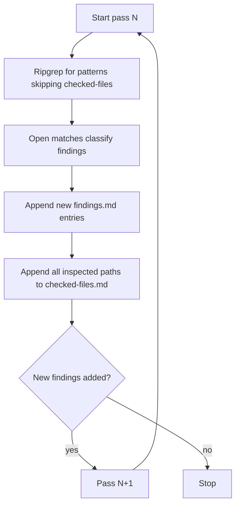

# UI/UX Leakage Audit Plan

## Output

Create [`packages/terriajs/doc/ui-ux-audit/`](packages/terriajs/doc/ui-ux-audit/) with:

- [`findings.md`](packages/terriajs/doc/ui-ux-audit/findings.md) — catalog of findings
- [`checked-files.md`](packages/terriajs/doc/ui-ux-audit/checked-files.md) — every `.ts`/`.tsx`/`.js`/`.jsx` already inspected (skip on later passes)

## Scope

**Include:** `packages/terriajs/lib/**` and `apps/terriamap/**` (source `.ts`/`.tsx`/`.js`/`.jsx` only).

**Primary targets (non-chrome / leakage surfaces):**

- Tools & Panels under ReactViews (e.g. `ReactViews/Tools/`, `ReactViews/Map/Panels/`)
- Models, Traits, ModelMixins, Table, Map, Core, ViewModels, ReactViewModels
- App shell: `apps/terriamap/lib/`

**Secondary (only for chrome magic numbers that bypass theme):**

- `ReactViews/` and `Styled/` when they hardcode colors/`px`/z-index instead of `theme` / Sass tokens
- Canonical token homes are **not** findings: [`lib/Sass/common/_default_variables.scss`](packages/terriajs/lib/Sass/common/_default_variables.scss), [`lib/Sass/exports/_variables-export.scss`](packages/terriajs/lib/Sass/exports/_variables-export.scss), [`lib/Core/StandardCssColors.ts`](packages/terriajs/lib/Core/StandardCssColors.ts) (document as “known token source”, don’t list every palette entry as a leak)

**Exclude from scanning:** `node_modules`, generated `*.d.ts` / `*.scss.d.ts`, build artifacts, `test/` (unless a hit is only a mirror of production leakage — skip tests to keep signal high).

## What counts as a finding

Record when a non-token file contains:

- Hardcoded colors: `#hex`, `rgb(`/`rgba(`/`hsl(`, named CSS colors used for UI
- Layout/chrome magic: `Npx`, z-index, breakpoints, border-radius, opacity used for UI chrome
- Sparse UI config objects (inline style maps, hardcoded panel widths/heights, animation timings for UI)
- UI concerns in Models/Traits/Mixins (default highlight/label/drawing colors, contrast colors, etc.)

Each finding entry: **file path**, **line(s) or symbol**, **category** (`color` | `spacing` | `layout` | `zIndex` | `themeBypass` | `dataVisualDefault`), **short snippet/value**, **note** (why it’s leakage vs intentional data viz).

## Iterative method (stop when empty)

**Pass order (batched by directory to keep progress recoverable):**

1. Traits + ModelMixins + Table + Core color/style defaults
2. Models + Map + ViewModels (drawing, basemap contrast, globe highlight)
3. ReactViews Tools + Map/Panels + SidePanel/Story tools
4. Remaining ReactViews + Styled chrome magic numbers
5. `apps/terriamap/lib` (and any other app ts/tsx/js/jsx with UI literals)
6. Final sweep: same pattern set over entire scope minus `checked-files.md`; if zero new findings → stop

**Search patterns (representative):**

- Colors: `#[0-9a-fA-F]{3,8}\b`, `\brgba?\(`, `\bhsla?\(`, `contrastColor`, `highlightColor`, `fillColor`, `strokeColor`
- Layout: `\d+px\b`, `zIndex` / `z-index`, `breakpoint`, `borderRadius` / `border-radius`
- Theme bypass: inline `style={{` with numeric/color literals; styled-components template literals with raw hex/`px`

When inspecting a file for any match, mark it **checked** even if it yields no finding (so later passes skip it).

## Seed known hotspots (verify in pass 1–2)

Already identified candidates to confirm and record:

- [`ModelMixins/Cesium3dTilesStyleMixin.ts`](packages/terriajs/lib/ModelMixins/Cesium3dTilesStyleMixin.ts) — `DEFAULT_HIGHLIGHT_COLOR`
- [`ModelMixins/RerPoiHelpers.ts`](packages/terriajs/lib/ModelMixins/RerPoiHelpers.ts) — POI colors
- [`Models/UserDrawing.ts`](packages/terriajs/lib/Models/UserDrawing.ts), [`Models/GlobeOrMap.ts`](packages/terriajs/lib/Models/GlobeOrMap.ts), [`Models/BaseMaps/defaultBaseMaps.ts`](packages/terriajs/lib/Models/BaseMaps/defaultBaseMaps.ts)
- Traits: `ColorStyleTraits`, `TableLabelStyleTraits`, `RerPoiCatalogItemTraits`
- Tools: `ReactViews/Tools/*/MovementControls.tsx`, HelpPanel `VideoGuide.jsx`

## Deliverable shape (findings.md)

- Summary counts by category and by layer (Traits / Models / Tools / Panels / Styled / App)
- Grouped sections by layer with bullet entries
- Brief “out of scope / intentional” note for Sass tokens and `StandardCssColors.ts`

No code refactors in this task — documentation only.
