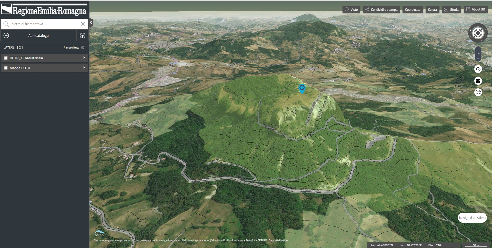

# RER3D-MAP

  
  

The **rer3d-map** is a website for map-based access to italian [Emilia-Romagna region](http://www.regione.emilia-romagna.it) spatial data from local government agencies.
Customizations and improvements has been developed and customized by [Bioretics srl](http://www.bioretics.com).

**rer3d-map** is the TerriaMap application of this monorepo, built against the
in-repo [terriajs](../../packages/terriajs) package (it previously tracked the
separate [rer3d-terriajs](https://github.com/bioretics/rer3d-terriajs) fork).

Go to the [wiki page](https://github.com/bioretics/rer3d-map/wiki) for installation guide.

---

## Upstream Terria Map notes

This app is based on upstream [Terria Map](https://github.com/TerriaJS/TerriaMap). See the
[TerriaJS README](https://github.com/TerriaJS/TerriaJS) for information about TerriaJS.
For a full list of changes, including the TerriaJS version shipped with each release, see
[CHANGES.md](CHANGES.md).

Major upstream announcements that affect fork maintenance (full list in
[TerriaJS announcements](https://github.com/TerriaJS/terriajs/discussions/categories/announcements)):

- **PM2 no longer supported (2023-03-21)** — `npm start` runs terriajs-server in the
  foreground; use `gulp dev` for development (runs the server plus incremental watch).
- **TerriaJS v8.3.0 (2023-05-22)** — upgraded to TypeScript 4.9.x and MobX 6.9.x; affects
  maps with local model-layer modifications.
- **Codebase reformatted with Prettier (2022-08-29)** — see
  https://github.com/TerriaJS/terriajs/discussions/6517 for merge guidance.
